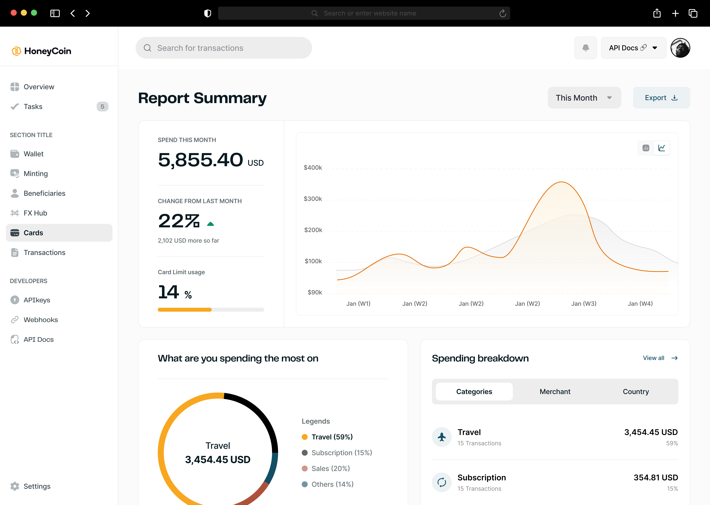
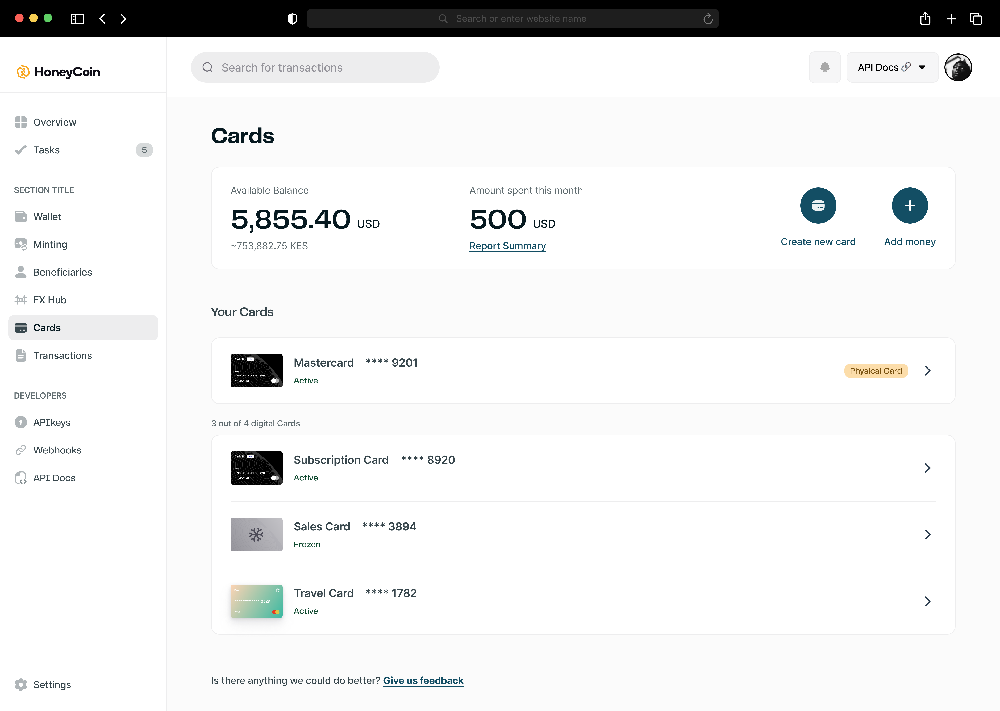

# HoneyCoin UI Challenge

## Project Overview
This project is a code challenge to recreate a part of our HoneyCoin for Business UI using Angular. The goal is to implement the dashboard and cards view as shown in the provided design mockups.

## Requirements

### Technologies
- Angular (latest stable version)
- TypeScript
- HTML5
- CSS3 (SCSS is preferred)

### Features to Implement
1. Dashboard View (Report Summary)
   - Display spending summary for the current month
   - Show change percentage from last month
   - Implement card limit usage indicator

   > Nice to haves
   - Create a line chart for spending trends
   - Display spending breakdown by category

2. Cards View
   - Show available balance and amount spent this month
   - List all cards with their details
   - Implement "Create new card" and "Add money" buttons

### Design Requirements
- Recreate the UI as closely as possible to the provided mockups
- Ensure responsive design for various screen sizes
- Use appropriate Angular components for different UI elements
- Implement a clean and maintainable code structure

## Mockups
Two mockup images have been provided:
1. Dashboard view (Report Summary)

2. Cards view

Please refer to these mockups for design details and layout.

## Data
For this challenge, you can use mock data. Create appropriate interfaces or types for the data structures you'll use.

## Evaluation Criteria
- Accuracy of UI implementation compared to the mockups
- Code quality and organization
- Use of Angular best practices and patterns
- Responsiveness and cross-browser compatibility
- Attention to detail in design implementation

## Submission
Feel free to push to this repo or fork it and share the link to the challenge when completed.

## Questions
If you have any questions or need clarifications, please don't hesitate to ask.

Good luck with the challenge!